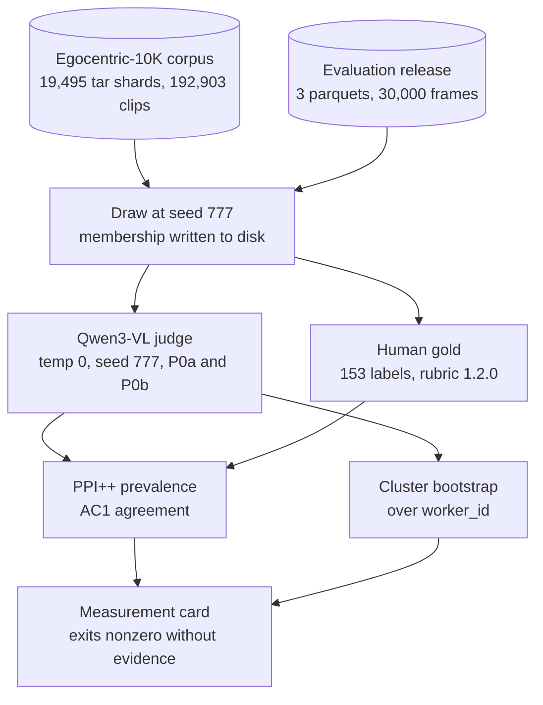

[Build AI](https://build.ai) sells egocentric factory video, and it sells it on a quality guarantee. The [evaluation release](https://huggingface.co/datasets/builddotai/Egocentric-10K-Evaluation) publishes the numbers behind that guarantee: 96.42% of frames show at least one hand, 76.34% show two, 91.66% show active manipulation, and all three beat [Ego4D](https://ego4d-data.org) and [EPIC-KITCHENS-100](https://epic-kitchens.github.io/2025). The corpus is real and large: 10,000 hours from 2,153 workers across 85 factories, with per-clip metadata and camera intrinsics, which is more than most academic egocentric datasets ship. That was never the part I wanted to check. Those three numbers come from 10,000 frames labelled exactly once, by `gemini-2.5-flash`, with no human label behind them, no confidence interval, and no test that the judge scores a factory floor and a home kitchen on the same scale. The comparison to EPIC-KITCHENS rests on that last assumption and the margin is about six points. Nobody has published a check. So I built one: a pre-registered audit with an open judge, a written rubric, human gold, and a measurement card that exits nonzero if any claim loses its evidence.

| | |
|---|---|
| **Measured** | the judge behind the number, not the corpus |
| **Judge** | Qwen3-VL-8B-Instruct-FP8, self-hosted, temperature 0, seed 777 |
| **Gold** | 153 frames, one rater, written rubric, 68 minutes of labelling |
| **Replication** | 2 of 3 published figures within 2pp, on two releases a year apart |
| **The outlier** | 2 hands, off by 6.32pp and 6.14pp, same direction both times |
| **Judge error** | 28 errors on 153 frames, 26 of them inflating the statistic |
| **The margin** | +6.62pp over EPIC becomes -1.02pp [-11.68, +9.65], unresolved |
| **Cost** | about $9 per 10,000 frames, no API vendor required |

The published number is not wrong in any way I can show. It is a point estimate with no interval, produced by a judge that over-reports far more often than it under-reports, and the honest range for the headline figure on the batch you would actually buy runs from 77.9% to 92.2%.

## The instrument

The judge is [Qwen3-VL-8B-Instruct-FP8](https://huggingface.co/Qwen/Qwen3-VL-8B-Instruct-FP8), served on one GPU through vLLM, temperature 0 and seed 777 pinned on every call, with Build AI's own prompts used verbatim from their dataset card. The original judge is not available: `gemini-2.5-flash` is deprecated for new API keys, which I confirmed with a live 404. That is itself a finding about the guarantee, because a quality SLA whose instrument is a versionless third-party API cannot be reproduced by the vendor either. Their per-frame labels ship inside the evaluation parquet, so the comparison runs against those instead of against a re-call.

The oracle is a person, not a model. I wrote a [rubric](https://github.com/caiotheodoro/vernier/blob/main/docs/RUBRIC.md) with twelve numbered rules resolving what their prompt leaves open (gloves, reflections, motion blur, an idle grip that is not manipulation), then labelled 153 frames across the three corpora: 63 Egocentric, 30 Ego4D, 60 EPIC-KITCHENS. Median eight seconds a frame, 68 minutes in total. The labelling tool has no read path to judge output; the rater cannot see what the model said, before or during a pass, and that is enforced in code rather than by discipline.

The statistics were chosen before any frame was drawn and frozen in a [pre-registration](https://github.com/caiotheodoro/vernier/blob/main/docs/PRE-REGISTRATION.md): [PPI++](https://arxiv.org/abs/2311.01453) for prevalence, so the interval stays valid however biased the judge turns out to be; Gwet's AC1 as the headline agreement statistic with Cohen's kappa reported beside it, because kappa is uninformative at 96% base rates; a cluster bootstrap over worker id, B = 10,000, wherever a worker id exists. Every deviation from that document is a dated entry in a decision log that now runs to 82 entries.



The whole thing costs about $9 per 10,000 frames to re-run, needs no API vendor, and the four evaluation passes behind the replication below came to $17.63 of GPU time.

## What replicated

**Two of the three published figures reproduce, and the same one misses on both releases.** I ran the open judge over 10,000 frames of `Egocentric-10K-Evaluation` and then over 10,000 frames of `Egocentric-100K-Evaluation`, their current product, a year apart.

```json
// cv-chart
{"type":"bars",
 "title":"An independent judge against Build AI's published figures, both releases",
 "series":[{"key":"measured","label":"Qwen3-VL, N=10,000 per release","color":0},
           {"key":"published","label":"Build AI published","color":1}],
 "domain":[0,1],
 "data":[{"label":"10K, >=1 hand","measured":0.9545,"published":0.9642},
         {"label":"10K, 2 hands","measured":0.8266,"published":0.7634},
         {"label":"10K, manipulation","measured":0.9128,"published":0.9166},
         {"label":"100K, >=1 hand","measured":0.9609,"published":0.9695},
         {"label":"100K, 2 hands","measured":0.8519,"published":0.7905},
         {"label":"100K, manipulation","measured":0.9214,"published":0.9276}],
 "caption":"Hand visibility and manipulation land within a point on both releases. The two-hands figure is 6.32pp high on the 10K release and 6.14pp high on the 100K release, in the same direction both times."}
```

An independent judge landing within a point on two of three figures, on two releases a year apart, is a real result in Build AI's favour and I will say so plainly. The two-hands figure is the exception, and it is off by six points twice.

I do not know why, and the honest reading cuts against me as much as against them. My own gold set shows this judge over-counting hands: it calls two hands on 107 of 153 frames where the rater counted 94. So the parsimonious explanation for a high two-hands rate is my judge, not their number. What keeps it interesting is that the same figure carries the largest design effect on both corpus draws, measured further down, and that three separate measurements single out the same column. Three measurements pointing at one figure, and none of them explaining it, is worth reporting and is not worth over-claiming.

## What the human labels changed

**Judge error runs one way, with two exceptions.** This is the finding I did not expect. Across 153 frames the open judge makes 28 errors against the rater, and 26 of them inflate the statistic. The two that do not are both on manipulation, and they arrived only after I doubled the gold set; at 93 frames there were none, and I said so in an earlier version of this post.

| task | judge over-reports | judge under-reports |
|---|---:|---:|
| hand count | **16** | 0 |
| active manipulation | **10** | 2 |

The at-risk denominators matter here, because a frame the rater scored as two hands cannot be over-counted: 16 of the 59 frames that could be over-counted were, and 0 of the 129 that could be under-counted were. On manipulation it is 10 of 33 against 2 of 120. The asymmetry is large and it is not absolute, and the difference between those two statements is the reason I doubled the gold set rather than publishing the first version of this table.

It also is not a quirk of the model I chose. Build AI's own stored `gemini-2.5-flash` labels, a different family from a different lab, carry the same sign on the same frames. Two judges, the same asymmetry.

The obvious objection is that my rater is simply strict, and the rubric's most discretionary rule is the one about an idle grip counting as false. So I checked the tags: none of the manipulation false positives carries the `idle-grip` tag. They are tagged blur, self-contact, another person in frame, or nothing at all. The rule most likely to manufacture disagreement produced none of it.

Correcting for that error with PPI++ moves the prevalence estimates, and gives them the interval the published figures do not have.

```json
// cv-chart
{"type":"forest",
 "title":"The published figure, the judge alone, and the gold-corrected estimate",
 "panels":[
  {"metric":"active manipulation","rows":[
    {"label":"Egocentric-10K, published","point":0.9166,"color":"neutral","note":"no interval published"},
    {"label":"Egocentric-10K, judge alone","point":0.9,"color":0},
    {"label":"Egocentric-10K, PPI++","point":0.8506,"ci":[0.779,0.9221],"color":1},
    {"label":"EPIC-KITCHENS-100, published","point":0.8504,"color":"neutral","note":"no interval published"},
    {"label":"EPIC-KITCHENS-100, PPI++","point":0.8607,"ci":[0.7817,0.9397],"color":1},
    {"label":"Ego4D, published","point":0.5007,"color":"neutral","note":"no interval published"},
    {"label":"Ego4D, PPI++","point":0.5,"ci":[0.3665,0.6335],"color":1}]},
  {"metric":">=1 hand","rows":[
    {"label":"Egocentric-10K, published","point":0.9642,"color":"neutral","note":"no interval published"},
    {"label":"Egocentric-10K, PPI++","point":0.9243,"ci":[0.8695,0.9792],"color":1},
    {"label":"EPIC-KITCHENS-100, published","point":0.9037,"color":"neutral","note":"no interval published"},
    {"label":"EPIC-KITCHENS-100, PPI++","point":0.8942,"ci":[0.8326,0.9557],"color":1},
    {"label":"Ego4D, published","point":0.6733,"color":"neutral","note":"no interval published"},
    {"label":"Ego4D, PPI++","point":0.612,"ci":[0.5022,0.7219],"color":1}]}],
 "caption":"n_gold is 63 on the Egocentric arm, 60 on EPIC-KITCHENS and 30 on Ego4D, against 200 judged frames per arm. Every published mark on this chart is a point with no width, and that is the mark being sold."}
```

The Egocentric manipulation rate, the headline, corrects from a published 91.66% to 85.06% with a 95% interval of [77.90, 92.21]. The published value sits just inside the top edge rather than outside it. The interval is still wide because 63 gold frames on that arm is not many, and it is a lower bound on the true width because the evaluation release ships no worker id to cluster over.

## The margin

**What Build AI sells is not a rate, it is a lead, and the lead is the thing I could not settle.** The comparative claim is that this corpus beats EPIC-KITCHENS-100 by 6.62pp on active manipulation and 6.05pp on hand visibility. Correcting both sides of a difference is a better-posed question than the one I pre-registered, and it is the question a buyer actually has.

```json
// cv-chart
{"type":"forest",
 "title":"Egocentric-10K minus EPIC-KITCHENS-100, published against gold-corrected",
 "panels":[
  {"metric":"margin in percentage points","rows":[
    {"label":"manipulation, published","point":6.62,"color":"neutral","note":"no interval published"},
    {"label":"manipulation, corrected","point":-1.02,"ci":[-11.68,9.65],"color":0},
    {"label":">=1 hand, published","point":6.05,"color":"neutral","note":"no interval published"},
    {"label":">=1 hand, corrected","point":3.02,"ci":[-5.23,11.26],"color":1}]}],
 "caption":"The manipulation margin changes sign under correction and is the only one of four that does, but at -1.02pp it is now barely distinguishable from zero. Both corrected intervals still cover the published value, so neither margin is resolved. Doubling the gold set moved both corrected margins toward the published figures, not away."}
```

The manipulation lead changes sign, from +6.62pp to -1.02pp. It is the only one of the four margins I computed that does, and at roughly one point it is close enough to zero that the sign is not the interesting part. The corrected interval still covers the published value, so I cannot refute that margin; I can only say the data does not settle it. This project's own [red team](https://github.com/caiotheodoro/vernier/blob/main/docs/RED-TEAM.md) wrote the rule for this case before any result existed: a wide interval containing the null is underpowered, not null, and treating the two as the same thing is the exact error the audit exists to object to. A headline claiming the margin reverses is not available on this data, and I drafted one before I checked.

The hand-visibility margin holds its sign but loses about half its size: published +6.05pp, corrected +3.02pp, with an interval of [-5.23, +11.26] that also covers the published value. Neither comparative claim is refuted and neither is confirmed.

The useful part is what happened when I acted on that. An earlier version of this post priced the gap at about 42 gold frames per arm, against the 33 and 30 that existed. I labelled 60 more. The margin moved toward the published value rather than away from it, and then the price itself turned out to be wrong: it scaled the whole standard error as one over root n, when only the gold term shrinks with more labels and the unlabelled pool sets a floor underneath. Corrected, the manipulation margin needs about 226 gold frames per arm, and the hand-visibility margin cannot be separated by labelling at any budget at all. Buying more labels made the vendor's number look better and made the bill larger, which is the outcome an audit has to be willing to publish.

## The design effect

**Ten thousand frames from 2,153 workers are not 10,000 independent observations.** Frames from one worker share scene, lighting, task, gloves and camera. The evaluation release cannot show this, because its `frame_id` is a bare UUID4 with no worker linkage, so I went to the raw corpus instead.

Getting there was the one piece of real engineering in the project. The corpus is 19,495 WebDataset tar shards holding 192,903 clips, about 16TB, and I did not want to download it. A tar header is 512 bytes at a computable offset, so an index of every clip can be built from HTTP range requests alone; ffmpeg's `subfile` protocol then extracts a single frame from an h265 MP4 inside a tar over the same range requests. Indexing all 19,495 shards took 23 minutes and moved about 150MB.

Two draws of 10,000 frames each, one uniform over frames and one stratified by factory worker-hours, then a cluster bootstrap over worker id against its iid counterpart.

```json
// cv-chart
{"type":"steps",
 "title":"Design effect by task, against the pre-registered threshold",
 "series":[{"key":"uniform","label":"S10k-U, uniform draw","color":0},
           {"key":"stratified","label":"S10k-S, factory-stratified","color":1}],
 "domain":[0,2.2],
 "band":{"from":1,"to":2,"label":"above 1 is real clustering; 2 was the pre-registered bar"},
 "data":[{"label":">=1 hand","uniform":1.2549,"stratified":1.3133},
         {"label":"2 hands","uniform":1.6227,"stratified":1.655},
         {"label":"manipulation","uniform":1.2744,"stratified":1.2909}],
 "caption":"B = 10,000, seed 777, clustered over worker_id, on 1,966 and 1,999 clusters. None of the six reaches 2, so the pre-registered hypothesis fails. All six exceed 1, so an interval computed as if frames were independent is 12% to 29% too narrow in width."}
```

I predicted a design effect of at least 2 and got 1.25 to 1.66, so my own hypothesis failed. The effect is real and smaller than I expected: an interval computed as if these frames were independent is 12% to 29% too narrow. The two-hands figure carries the largest design effect on both arms, which is the third measurement singling out that column.

This is measured on my draws, not on Build AI's evaluation frames, and I cannot close that gap. Their release ships no grouping variable, so nobody outside the vendor can measure the design effect on the sample the published figures were computed from. The published figure inherits this; it was never measured.

Building the index also counted the corpus: 2,144 distinct workers against a published 2,153, with factories, hours and clip count reconciling almost exactly. Nine workers, 0.42%, consistent with ordinary release-time filtering and too few to move anything. I record it so a reader comparing counts knows why they differ.

## What broke when I audited my own audit

The project's fourth rule is that every instrument it points at Build AI gets pointed at itself, and anything that breaks gets published broken. Over one working session, four claims in my own prose turned out to overstate what my own data showed. Every one was caught by a person reading carefully, and none by any automated check.

**The blind re-label did not wait seven days.** The pre-registration specifies a re-label at least seven days after the first pass, so that the check measures whether the rubric is decidable rather than whether the rater remembers the frame. Five documents repeat that rule. Measured from the labels' own timestamps: a median separation of 2.4 hours, a maximum of 8, and 0 of 34 pairs meeting it. The writeup asserted the seven days as fact. Those timestamps had been public in the Hub dataset release the entire time, so any reader could have checked, and nobody here did. The agreement figures do not move; what they license does. The check now covers consistency within one session and cannot separate that from recall, and the separation is measured by the pipeline into the result file instead of being asserted in prose.

**A control arm arrived after the labels it was meant to control.** I re-reviewed the 18 frames where the judge and the rater disagreed, and mixed in an equal number of control frames the two had agreed on, so that a revision rate on one arm could be compared against the other. The git history shows the control arm was added in a later commit than the labels, which had been collected against a plan containing 18 disagreement frames and nothing else. The tool's own code comments name that failure: a sitting that is almost all one arm is exactly the tell the controls exist to remove. The pass had to be re-planned and re-run.

**Seven labels broke a rubric rule that nothing enforced.** Rule 12 says zero visible hands implies no manipulation. Seven collected labels said zero hands and manipulation true. Neither the data model nor either labelling tool rejected the combination. It surfaced from the rater rather than the tooling: one record carried a note reading "no active manipulation" beside a value of true, so it contradicted itself in writing, and checking whether the pair occurred elsewhere found the other six. Correcting them moved judge-human agreement on manipulation, moved two PPI estimates, and removed a clean zero-errors-on-EPIC result that a draft of this post had been built on. The rule now lives in a module, both labelling tools re-ask when a frame breaks it, and a checker sweeps every pass.

**The coverage table claimed an experiment ran that never ran.** The document listing what the audit does not cover said "Tested" for the cross-domain judge accuracy experiment. That experiment specifies a model, judge error against domain and task with cluster-robust intervals. It was never fitted. What exists is a comparison of two raw error rates at n=33 and n=30 with no interval on the difference. The document whose opening sentence says an audit enumerating only its findings misleads by omission was doing exactly that.

The pattern is uncomfortable and worth stating: the measurements held up every time, and the sentences about them kept drifting. Numbers are checkable by a machine and prose is not, so prose is where the errors accumulated. The repository now runs a check that pins every figure in its writeups to the file that produces it, in both directions, so a number that moves in an artifact fails the build and a claim quietly deleted from the prose fails it too. That check would have caught two of these four. The other two, a coverage table saying "Tested" and a control arm added a commit too late, are still only catchable by reading.

## What didn't work

**H1b, the two prompt variants, is null.** Build AI's dataset card and their shipped prompt file are different prompts, differing in four places including a substantive rule about whose hands to ignore. I expected the two to disagree by at least a point on manipulation. They differ by 0.32pp, so which prompt produced the published number does not matter as much as I thought it would.

**Prompt sensitivity is real and small.** Eight variants across 2,000 frames: manipulation rates spread 1.25pp, hand-count rates 0.25pp. The direction I predicted holds, manipulation is the softer definition, and the magnitude sits well under the 5pp bar I set. The single strongest test, an explicit instruction that a gloved hand counts, moved the hand figure by 0.05pp in a corpus of factory work where gloves are near-universal.

**Domain bias points the predicted way now, and still does not clear the bar.** Judge error on manipulation is 4.76% on Egocentric frames and 8.33% on EPIC-KITCHENS, a gap of 3.57pp with EPIC higher, which is the direction the pre-registration predicted. At 93 labels it pointed the other way. The pre-registered threshold was 5pp, so it does not hold either way, and a hypothesis whose sign flips when the sample doubles is telling you about the sample. My own power analysis, run before any labelling, called this underpowered even at the full pre-registered size, so a reversed result here is ambiguous rather than informative. There is also a live confound I disclosed before the data existed and never probed: the judge has plausibly seen EPIC-KITCHENS and Ego4D in pretraining and cannot have seen the gated Egocentric corpus, which pushes accuracy in the opposite direction from the prediction. A null here has three readings and I can rule out none of them.

**Distillation missed its target.** A linear probe on frozen DINOv2 features reaches 0.6933 agreement with the teacher against a 0.90 target, and the abstention cascade cannot hold a 0.80 agreement floor at any coverage above zero at 95% confidence, on a calibration split of 46 frames. The probe is published anyway, labelled as a negative result. The cheap re-runnable instrument this project promised is the open judge at $9 per 10,000 frames, not the distilled thing.

**Calibration is degenerate by construction.** Expected calibration error is 0.1043 on hand count and 0.0782 on manipulation, but almost every frame lands in a single confidence bin under greedy decoding. That number describes the decoding strategy more than the judge, and reporting it as a calibration result would be misleading.

## Honest limits

One rater, 153 frames, 68 minutes of labelling, and no inter-rater agreement statistic anywhere in this project, because there is one person. Sixty of those labels were added after I had seen the first set of results, which is a real exposure: I knew which direction would move the margin when I labelled them. They moved it the other way, toward the vendor, which is evidence against the bias but not proof of its absence. The two batches also differ in pace: the first 93 ran at a median of ten seconds a frame, the 60 added afterwards at three, with 24 of them at two seconds or less. Three seconds is fast for adjudicating a frame the rubric leaves open, and the second batch is the half that moved every headline number. The blind re-label is a weaker substitute and, as run, weaker again: a median of 2.4 hours, not the seven days specified. The rater wrote the rubric after reading Build AI's prompt, which is anchoring and is not removable at n=1. The two judge arms share plausible pretraining lineage, so agreement between them is an upper bound on reliability rather than a measure of it. The design effect is measured on my corpus draws and never on the vendor's evaluation frames, and nothing can measure it there until a grouping variable ships. The margin estimand is exploratory, not pre-registered, and its interval covers the published value. Half the advertised SLA, the pose accuracy claim, needs annotations no public release ships and is untouched here. Whether hand visibility predicts training value, which is the premise of the entire metric, is untested and now will not be. Every interval on the evaluation arms is iid and labelled as a lower bound on its true width. The 28 judge errors come from 153 frames, and 28 events is a small number to carry a directional claim.

## What this is for

A vendor can publish a quality statistic without publishing an interval, and buyers currently have no way to check it. The instrument that produces a range costs about $9 per 10,000 frames, needs no API vendor, and is public. On this corpus it says the published figures mostly reproduce, that the judge behind them errs in one direction on every frame where a human disagrees, and that one of the two comparative claims does not survive correcting for it. The cheapest upgrade to that guarantee is an interval. The second cheapest is a second rater on 200 frames, which is the one number this project cannot produce alone and the dataset release is set up to receive.

Code is at [github.com/caiotheodoro/vernier](https://github.com/caiotheodoro/vernier). The labels, membership, judge output and every result file are on the Hub at [caiotheodoro/vernier](https://huggingface.co/datasets/caiotheodoro/vernier), the probe at [vernier-rung1-probe](https://huggingface.co/caiotheodoro/vernier-rung1-probe), and a frame-by-frame view of every judge and rater disagreement is at the [Space](https://huggingface.co/spaces/caiotheodoro/vernier). Collection: [caiotheodoro/vernier](https://huggingface.co/collections/caiotheodoro/vernier-same-judge-same-6pp-on-2-hands-both-releases-6a9b1bc9fac182a7a2d9c997). The [measurement card](https://github.com/caiotheodoro/vernier/blob/main/MEASUREMENT_CARD.json) carries 18 claims, each tied to the file that produced it, and reports a verdict of NOT_VERIFIED because one item could not be checked at all. The 24 frames in the Space are the only frames this project republishes, and there is no second copy of any of them anywhere, which is what makes a withdrawal request something I can actually honour.
